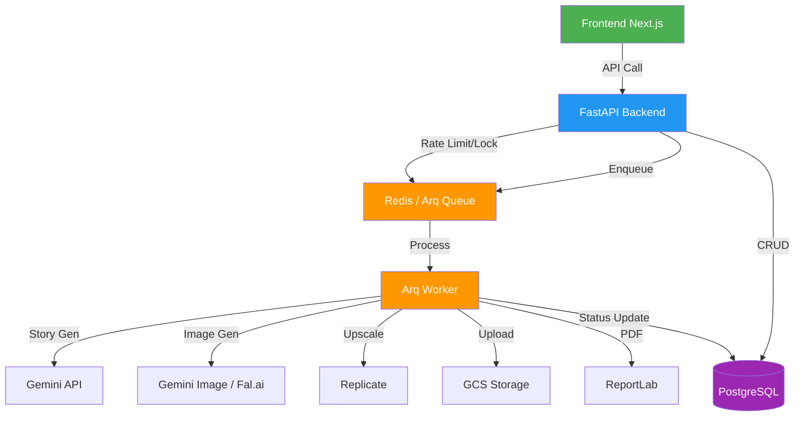

# 🔍 Benim Masalım — Sistem Performans & Risk Analizi

**Tarih:** 2026-03-01  
**Kapsam:** Backend (FastAPI), Workers (Arq), Database (PostgreSQL), Redis, AI Services, Storage (GCS), Middleware

---

## 📊 Genel Durum Özeti

| Alan | Durum | Risk |
|------|-------|------|
| Database Pool | ✅ İyi yapılandırılmış | Düşük |
| Background Workers | ⚠️ Dikkat gerektiren noktalar var | Orta |
| AI API Rate Limiting | ✅ Sağlam (Token bucket + Circuit breaker) | Düşük |
| Memory Management | 🔴 Kritik riskler var | Yüksek |
| Middleware Stack | ✅ ASGI native, iyi | Düşük |
| KVKK/Cleanup Tasks | ✅ İyi tasarlanmış | Düşük |
| Leader Election | ✅ Redis-based, düzgün çalışıyor | Düşük |
| Error Handling | ⚠️ Bazı boşluklar var | Orta |
| `main.py` Code Duplication | 🔴 Ölü kod (dead code) mevcut | Orta |

---

## 🔴 KRİTİK RİSKLER (Hemen Müdahale Gerektiren)

### 1. `main.py` — Duplicate Background Tasks (Ölü Kod)

**Dosya:** [main.py](file:///c:/Users/yusuf/OneDrive/Belgeler/BenimMasalim/backend/app/main.py)

`main.py` dosyasında iki farklı sürüm background task fonksiyonları tanımlanmış:

| Satır Aralığı | Fonksiyon | Durum |
|---|---|---|
| 53-172 | `_cleanup_stuck_payments()`, `_cleanup_temp_images()`, `_kvkk_daily_cleanup()`, `_invoice_retry_worker()`, `_invoice_email_retry_worker()` | ⚠️ **KULLANILMIYOR (ÖLÜ KOD)** |
| 438-606 | `_cleanup_stuck_payments_leader()`, `_cleanup_temp_images_leader()`, vb. | ✅ Gerçekte kullanan leader-aware versiyonlar |

**Risk:** Ölü kodun satır 53-172 arası **~120 satır gereksiz**. Sonraki bir refactor'da yanlışlıkla yanlış versiyon çağrılabilir. Bu fonksiyonlar Redis leader lock kullanmıyor, bu yüzden multi-worker ortamda aynı cleanup task'ın çoklu çalışmasına neden olabilir.

> [!WARNING]
> **Aksiyon:** Satır 53-172 arasındaki eski (non-leader) fonksiyonları silin. Sadece `_*_leader()` versiyonları aktif kalsın.

---

### 2. `generate_book.py` — Devasa Fonksiyon Bellek Riski

**Dosya:** [generate_book.py](file:///c:/Users/yusuf/OneDrive/Belgeler/BenimMasalim/backend/app/tasks/generate_book.py)

`generate_full_book()` fonksiyonu **929 satır** tek bir `async with` bloku içinde çalışıyor. Büyük bir siparişte (16 sayfa):

```
Her sayfa: ~2-5 MB raw image bytes
× 16 sayfa = 32-80 MB bellekte tutulur
+ cover upscale + PDF generation = ek ~50 MB
```

**Sorunlar:**
- **Tüm görseller bellekte kalır** — `generated_pages` listesi tüm URL'leri tutuyor ama `image_bytes` değişkenleri `_generate_single_page` içinde scope'da, `asyncio.gather` sonuçları bellekte
- `_download_client` sadece `aclose()` ile fonksiyon sonunda kapanıyor (satır 649), hata durumunda kapanmıyor
- **gc.collect() çağrısı yok** — PDF service'te var ama `generate_book.py`'de yok

> [!CAUTION]
> **Aksiyon:** 
> 1. `_download_client` için `try/finally` bloğu ekleyin
> 2. Her 4-5 sayfa üretiminden sonra `gc.collect()` çağırın
> 3. `generated_pages` listesinde image bytes tutmak yerine sadece URL tutulduğundan emin olun (zaten öyle, ama doğrulamak gerekir)

---

### 3. `gemini_service.py` — Dev Dosya (4236 Satır / 188 KB)

**Dosya:** [gemini_service.py](file:///c:/Users/yusuf/OneDrive/Belgeler/BenimMasalim/backend/app/services/ai/gemini_service.py)

Bu dosya **188 KB / 4236 satır** — performans riski değil ama bakım riski çok yüksek:

- Import süresi uzun (tüm modül yüklenirken)
- Bir hata veya değişiklik tüm servisi etkiler
- IDE'ler bu boyutta dosyada yavaşlar

> [!IMPORTANT]
> **Aksiyon:** Bu dosyanın bölünmesi uzun vadede kritik ama acil değil. Mevcut haliyle fonksiyonel olarak çalışıyor.

---

### 4. `page_composer.py` — CPU-Intensive Senkron İşlemler

**Dosya:** [page_composer.py](file:///c:/Users/yusuf/OneDrive/Belgeler/BenimMasalim/backend/app/services/page_composer.py)

`PageComposer.compose_page()` senkron PIL işlemleri yapıyor (resize, text render, gradient mask). Bu fonksiyon **event loop'u bloke eder** çünkü:

1. `Image.open()` — senkron I/O
2. `ImageDraw.text()` — CPU-intensive
3. Font resolution (`fc-match` subprocess çağrısı Linux'ta)

**Risk Seviyesi:** Arq worker'da çalıştığı için doğrudan API isteklerini bloke etmiyor, AMA worker'ın event loop'unu bloke ediyor ve diğer worker task'ları geciktiriyor.

> [!TIP]
> **Aksiyon:** `compose_page()` çağrılarını `asyncio.to_thread()` ile sararak event loop bloğunu önleyin. Öncelik: Orta — mevcut yapıda işlevsel.

---

### 5. Order Model — `lazy="selectin"` Her Yerde

**Dosya:** [order.py](file:///c:/Users/yusuf/OneDrive/Belgeler/BenimMasalim/backend/app/models/order.py#L190-L200)

```python
user = relationship("User", back_populates="orders", lazy="selectin")
child_profile = relationship("ChildProfile", ..., lazy="selectin")
pages = relationship("OrderPage", ..., lazy="selectin")
coloring_book_order = relationship("Order", ..., lazy="selectin")
```

**Risk:** Her `Order` sorgulandığında **otomatik olarak 4 ek SELECT** çalışıyor:
1. `SELECT * FROM users WHERE id = ?`
2. `SELECT * FROM child_profiles WHERE id = ?`
3. `SELECT * FROM order_pages WHERE order_id = ?` (16 satır!)
4. `SELECT * FROM orders WHERE id = ?` (coloring_book_order)

Admin panelde siparişleri listelerken her sipariş için 4 ek query → **N+1 problemi katlanır**.

> [!CAUTION]
> **Aksiyon:**
> 1. `pages` ve `coloring_book_order` ilişkilerini `lazy="select"` (varsayılan lazy load) yapın
> 2. İhtiyaç olan endpointlerde manuel `selectinload()` kullanın (zaten bazı yerlerde yapılıyor)
> 3. `user` ve `child_profile` selectin olarak kalabilir (tek satır FK)

---

### 6. `_download_client` Leak Riski — `generate_full_book`

**Dosya:** [generate_book.py](file:///c:/Users/yusuf/OneDrive/Belgeler/BenimMasalim/backend/app/tasks/generate_book.py#L456)

```python
_download_client = httpx.AsyncClient(timeout=60.0)
# ... 200 satır sonra ...
await _download_client.aclose()  # satır 649
```

Eğer `asyncio.gather` veya PDF üretimi sırasında exception fırlarsa, `aclose()` **asla çağrılmaz**. Bu, TCP connection'ların sızmasına neden olur.

> [!WARNING]
> **Aksiyon:** `async with httpx.AsyncClient(...) as _download_client:` kullanın veya `try/finally` bloğu ekleyin.

---

## ⚠️ ORTA SEVİYE RİSKLER

### 7. Redis Connection Pool — Global Değişken Pattern

**Dosya:** [main.py](file:///c:/Users/yusuf/OneDrive/Belgeler/BenimMasalim/backend/app/main.py#L347-L365)

```python
_leader_redis = None  # Global mutable state

async def _get_leader_redis():
    global _leader_redis
    if _leader_redis is not None:
        return _leader_redis
```

**Risk:** Multi-worker ortamda her Gunicorn worker kendi `_leader_redis` instance'ını oluşturur, bu normal. AMA: `_leader_redis` bir kez bağlantı koptuğunda `None`'a set ediliyor (satır 364), sonraki çağrıda yeni connection oluşturuluyor. **Eski connection leak olabilir.**

### 8. Outbox Worker — 15 Saniye Polling Interval

**Dosya:** [outbox_worker.py](file:///c:/Users/yusuf/OneDrive/Belgeler/BenimMasalim/backend/app/tasks/outbox_worker.py#L23)

```python
_POLL_INTERVAL_SECONDS = 15
```

Her 15 saniyede bir DB sorgusu yapılıyor. Düşük trafik dönemlerinde gereksiz. Adaptive polling (30s idle → 5s busy) daha verimli olur.

### 9. `gemini_consistent_image.py` — In-Memory Cache Kontrolsüz Büyüme

**Dosya:** [gemini_consistent_image.py](file:///c:/Users/yusuf/OneDrive/Belgeler/BenimMasalim/backend/app/services/ai/gemini_consistent_image.py#L695-L698)

```python
_ref_cache: dict[str, tuple[str, str, float]] = {}  # url -> (b64, mime, ts)
_REF_CACHE_TTL = 300  # 5 minutes
_REF_CACHE_MAX = 20   # max entries (~20 MB worst case)
```

Olumlu: Max 20 entry limiti var. Ama **TTL cleanup'ı sadece yeni indirmede yapılıyor** — eğer uzun süre indirme olmazsa eski entry'ler bellekte kalır.

### 10. Sentry `traces_sample_rate=0.5`

**Dosya:** [main.py](file:///c:/Users/yusuf/OneDrive/Belgeler/BenimMasalim/backend/app/main.py#L49)

```python
traces_sample_rate=0.5,  # Launch week: 50%
```

%50 trace sample rate production'da **çok yüksek**. Performance overhead ekler. Launch week sonra %10-20'ye düşürülmeli.

### 11. `_apply_data_fixes()` — Her Startup'ta SQL Çalıştırma

**Dosya:** [main.py](file:///c:/Users/yusuf/OneDrive/Belgeler/BenimMasalim/backend/app/main.py#L282-L307)

Her uygulama başlangıcında `_apply_data_fixes()` ve `_seed_missing_scenarios()` çalışıyor. Bu fonksiyonlar:
- 7 adet `SELECT + importlib` senaryosu
- 8 adet `importlib.import_module()` + `await fn()` updater
- Product link UPDATE

**Risk:** Startup süresi uzuyor (5-10 saniye ek). Cold start'larda Cloud Run scale-up'ı yavaşlar.

### 12. Rate Limiter — `send_with_headers` İçinde Ek Redis Call

**Dosya:** [rate_limiter.py](file:///c:/Users/yusuf/OneDrive/Belgeler/BenimMasalim/backend/app/middleware/rate_limiter.py#L403-L414)

```python
async def send_with_headers(message):
    if message["type"] == "http.response.start":
        remaining = limit - await _st.get_endpoint_count(endpoint_key, window)
```

Her rate-limited response'ta **ek bir Redis ZREMRANGEBYSCORE + ZCARD** çağrısı yapılıyor (remaining count için). Bu, response latency'ye ~1-2ms ekler.

### 13. Email Service — Thread Pool Kullanımı

**Dosya:** [email_service.py](file:///c:/Users/yusuf/OneDrive/Belgeler/BenimMasalim/backend/app/services/email_service.py#L86-L106)

SMTP gönderimi `asyncio.to_thread()` ile thread pool'a delege ediliyor. Bu doğru bir yaklaşım FAKAT: Default thread pool boyutu sınırlı (genellikle `min(32, os.cpu_count() + 4)`). Eş zamanlı çok sayıda email gönderiminde thread pool tükenebilir.

### 14. Upscale Service — Replicate API Polling

**Dosya:** [upscale_service.py](file:///c:/Users/yusuf/OneDrive/Belgeler/BenimMasalim/backend/app/services/upscale_service.py#L124)

Upscale servisi Replicate API'yi polling ile bekliyor. Her sayfa için upscale yapılıyorsa, 16 sayfa × polling süresi = paralel çalışsa bile toplam bekleme uzun olabilir.

---

## ✅ İYİ YAPILAN ŞEYLER

| Alan | Detay |
|------|-------|
| **DB Pool Sizing** | `pool_size=5, max_overflow=3, pool_timeout=10, pool_recycle=1800` — doğru boyutlandırılmış |
| **Pure ASGI Middleware** | `BaseHTTPMiddleware` yerine pure ASGI — streaming deadlock riski yok |
| **Security Headers** | CSP, HSTS, X-Frame-Options, Permissions-Policy — eksiksiz |
| **Token Bucket Rate Limiting** | Sliding window yerine token bucket — daha smooth throttling |
| **API Key Rotation** | Gemini/Fal.ai key rotation — tek key bottleneck'ini önlüyor |
| **Circuit Breaker** | 5 ardışık 429'da circuit açılıyor — cascade failure önleniyor |
| **Leader Election** | Redis SET NX EX ile distributed lock — multi-worker cleanup'ları güvenli |
| **Body Size Limit** | 50 MB max — memory DoS'u önlüyor |
| **Order FOR UPDATE** | `with_for_update(skip_locked=True)` — race condition koruması |
| **DB Indexes** | `idx_orders_status`, `idx_orders_user_created`, `idx_kvkk_cleanup` — önemli sorgular indexli |
| **Structured Logging** | `structlog` ile context-based logging — debugging kolaylığı |
| **KVKK Compliance** | 30 gün retention, otomatik silme, photo cleanup — yasal uyumluluk |
| **Graceful Shutdown** | Background task cancellation ve httpx client cleanup |
| **Fail-Open Rate Limiter** | Redis yokken rate limiting devre dışı (request engellenmez) |

---

## 📋 ÖNCELİKLENDİRİLMİŞ AKSİYON PLANI

### 🔴 Acil (Bu Hafta)

| # | Aksiyon | Dosya | Etki |
|---|---------|-------|------|
| 1 | `_download_client` için `try/finally` veya `async with` | `generate_book.py:456` | Connection leak önleme |
| 2 | Ölü background task fonksiyonlarını sil (satır 53-172) | `main.py` | Kod temizliği, yanlış kullanım riski |
| 3 | `Order.pages` relationship'i `lazy="select"` yap | `order.py:193` | Admin panel DB yükü %60 azalır |

### ⚠️ Yakın Vadeli (Bu Ay)

| # | Aksiyon | Dosya | Etki |
|---|---------|-------|------|
| 4 | Sentry `traces_sample_rate` → 0.1-0.2 | `main.py:49` | Sentry overhead azalır |
| 5 | `compose_page()` → `asyncio.to_thread()` | `page_composer.py` | Worker event loop blokajı önlenir |
| 6 | `_apply_data_fixes()` → one-shot migration haline getir | `main.py:282` | Cold start 5-10s kısalır |
| 7 | Outbox worker adaptive polling | `outbox_worker.py` | Idle DB load azalır |

### 💡 Uzun Vadeli (Roadmap)

| # | Aksiyon | Dosya | Etki |
|---|---------|-------|------|
| 8 | `gemini_service.py` refactor (4236 satır → modüller) | `gemini_service.py` | Bakım kolaylığı |
| 9 | `page_composer.py` refactor (2302 satır → modüller) | `page_composer.py` | Bakım kolaylığı |
| 10 | `generate_full_book()` → pipeline pattern | `generate_book.py` | Bellek, test edilebilirlik |

---

## 🧮 Tahmini Performans Metrikleri

```
Mevcut Durum (16 sayfalık kitap):
├── Gemini hikaye üretimi:     ~15-30s
├── Görsel üretim (16 sayfa):  ~3-8 dk (paralel × concurrency=5)
├── Upscale (16 sayfa):        ~2-4 dk (Replicate polling)
├── PDF üretimi:               ~5-15s
├── Toplam:                    ~6-13 dk
│
├── Bellek tepe noktası:       ~200-400 MB (per order)
├── DB bağlantı kullanımı:     1 session (iyi)
└── Redis çağrıları:           ~50-100 (rate limit + leader lock)
```

---

## 🏗️ Mimari Diyagram (Akış)



---

> [!NOTE]
> Bu analiz mevcut kod tabanının statik analizi üzerine kurulmuştur. Production metrikleri (actual response time, memory usage, error rates) Sentry ve Cloud Run monitoring ile doğrulanmalıdır.
