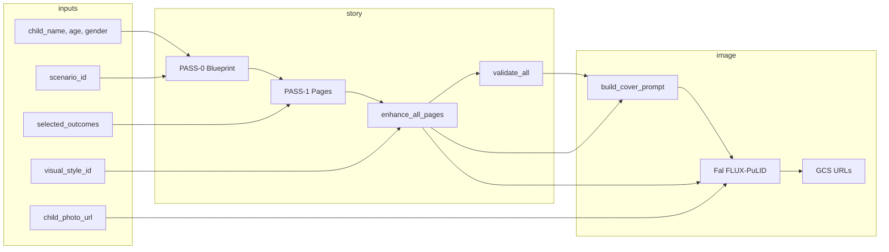

# V3 Prompt System — Full Audit

**Tarih:** 2025-02  
**Kapsam:** V3 prompt pipeline uçtan uca (kullanıcı girişleri → hikaye → sayfa promptları → görsel üretim → post-processing).

---

## Executive Summary

V3 pipeline tek kaynak olarak **blueprint + visual_prompt_builder** kullanıyor: PASS-0 blueprint, PASS-1 sayfa metni + ham image_prompt_en, sonra `enhance_all_pages` ile CharacterBible, SceneDirector, style, value motif birleştiriliyor. Görsel üretim **Fal.ai Flux-PuLID** ile yapılıyor; referans görsel (çocuk fotoğrafı) `reference_image_url` + `id_weight` ile veriliyor. Style hem DB’deki `visual_styles` hem `constants.py` / `style_adapter.py` içindeki 7 stil ailesiyle eşleşiyor. **Potansiyel bug:** "a glowing ancient symbol" türevleri (`_strip_embedded_text` + `_sanitize_v3_prompt_text`) regex/gramer artefaktından kaynaklanıyor; sanitizer düzeltmeleri var ama typos ("symbolm", "Ia glowing") için ek lint/validator önerilir. **Style weight:** id_weight DB’den veya `get_pulid_weight_for_style` ile geliyor; UI’dan gelen style backend’de kullanılıyor. **Eksiklikler:** Merkezi prompt linter (conflict + forbidden + required token + uzunluk), ve PII/anonimleştirme stratejisi dokümante değil.

---

## 1) Pipeline Haritası

### 1.1 Kullanıcı girişleri

| Giriş | Kaynak | Backend alan / akış |
|-------|--------|----------------------|
| Çocuk adı | UI | `child_name` (order/trial) |
| Yaş | UI | `child_age` |
| Cinsiyet | UI | `child_gender` (erkek/kiz) |
| Macera | UI (9 senaryo) | `scenario_id` → Scenario; `location_key` blueprint + scenario_bible’dan |
| Değer | UI (9 kazanım) | `selected_outcomes` → LearningOutcome; VALUE_MESSAGE_TR / VALUE_VISUAL_MOTIF_EN (gemini_service) |
| Görsel stil | UI (7 stil) | `visual_style_id` → VisualStyle; prompt_modifier + constants/style_adapter |
| Yüklenen görsel | UI upload | `child_photo_url` (GCS); Fal’a `reference_image_url` + PuLID `id_weight` |

- **API giriş noktaları:** `POST /api/v1/ai/generate-story` (tam kitap), `POST /api/v1/trials/...` (trial/preview). Orders: `orders.py` içinde order oluşturma + generate_book task.

### 1.2 Story generation (LLM)

- **PASS-0 (Blueprint):** `gemini_service._pass0_generate_blueprint` → `blueprint_prompt.BLUEPRINT_SYSTEM_PROMPT` + `build_blueprint_task_prompt`. Çıktı: JSON (title, page_count, pages[{page, role, shot_type, scene_goal, cultural_hook, magic_touch, visual_brief_tr}]).
- **PASS-1 (Sayfa metni + ham promptlar):** `gemini_service._pass1_generate_pages` → `page_prompt.PAGE_GENERATION_SYSTEM_PROMPT` + `build_page_task_prompt(..., value_message_tr=...)`. Çıktı: sayfa başına `text_tr`, `image_prompt_en`, `negative_prompt_en`.
- **Model/parametreler:** `get_gemini_story_url()`, `story_model` (örn. gemini-2.0-flash), `story_temperature` (0.92), maxOutputTokens 16000 (PASS-0) / 32000 (PASS-1). API key `settings.gemini_api_key`.

### 1.3 Page prompt generation (22 sayfa)

- **Birleştirme:** PASS-1 çıktısı `generate_story_v3` içinde alınıyor; sonra:
  - `build_character_bible(...)` (character_bible.py)
  - `enhance_all_pages(pages, blueprint, character_bible, visual_style, location_key, value_visual_motif=...)` (visual_prompt_builder.py)
  - Her sayfa için `compose_enhanced_prompt(raw_prompt=..., character_bible, shot_plan, visual_beat, style_mapping, ..., value_visual_motif)` → final `image_prompt_en`
  - Kapak: `build_cover_prompt(..., value_visual_motif=...)` → cover prompt + cover negative
- **Shot plan:** `scene_director.build_shot_plan(blueprint_pages)` → sayfa bazlı ShotPlan (shot_type, page_shot_type WIDE_FULL_BODY/CLOSE_UP, prompt_fragment). Blueprint’te `shot_type: "CLOSE_UP"` varsa o sayfada "full body head-to-feet" eklenmiyor.
- **Negatif:** `build_enhanced_negative(character_bible, style_mapping, ...)` (visual_prompt_builder); kapak için ek text-blocking token’lar.
- **Doğrulama:** `validate_all(pages, character_bible, style_mapping, value_visual_motif=...)` (visual_prompt_validator.py); SHOT_CONFLICT, VALUE_MOTIF_MISSING, PLACEHOLDER, OUTFIT_LOCK, NO_TEXT_MISSING, STYLE_MISMATCH, ANCHOR_CONTEXT, EMBEDDED_TEXT, NEAR_DUPLICATE. Gerekirse autofix uygulanıyor.

### 1.4 Image generation

- **Servis:** Fal.ai — `fal_ai_service.FalAIService`. Model: `FalModel.FLUX_PULID` (referans varsa), yoksa `FLUX_DEV`.
- **Parametreler (fal_ai_service + fal_request_builder):**
  - `num_inference_steps`: 28 (GenerationConfig)
  - `guidance_scale`: 3.5
  - `image_size`: cover → COVER_WIDTH/HEIGHT, inner → INNER_WIDTH/HEIGHT (core/image_dimensions)
  - `max_sequence_length`: 512 (prompt kesilmesin diye)
  - **Referans:** `reference_image_url` = child_photo_url, `id_weight` = DB (VisualStyle.id_weight) veya `get_pulid_weight_for_style(style_modifier)` (constants.STYLE_PULID_WEIGHTS), `start_step`: 2 (PuLIDConfig), `true_cfg`: 1.0
  - **seed:** `GenerationConfig.seed` set ise payload’a ekleniyor; aksi halde Fal rastgele üretir.
- **Çağrı yolu:** trials/orders → `generate_consistent_image` / `_generate_with_composed_prompt`; prompt/negative doğrudan V3 composed değerler.

### 1.5 Post-processing

- **Prompt temizleme:** `_sanitize_v3_prompt_text`, `_remove_shot_conflict`, `_strip_embedded_text`, `_strip_existing_composition` (visual_prompt_builder); truncate_safe_2d ile MAX_FAL_PROMPT_CHARS (2048) sınırı.
- **Validation:** Yukarıdaki `validate_all` + autofix.
- **Logging:** structlog; FINAL_PROMPT_SENT_TO_FAL, PROMPT_DEBUG (page_index, final_prompt_after, negative_prompt_final, model, id_weight, vb.).
- **Storage:** Order/OrderPage (image_url, negative_prompt, v3_composed, pipeline_version); trial/preview cache (generated_prompts_cache, blueprint_json, page_manifest).

---

## 2) Kod Bileşenleri & Dosya Envanteri

### 2.1 Pipeline sürümü ve V2/V3 etiketleri

| Dosya | Rol |
|-------|-----|
| `backend/app/core/pipeline_version.py` | Sadece v3 kabul; `prompt_builder_name_for_version("v3")` → "v3_blueprint_visual_prompt_builder". |
| `backend/app/services/ai/gemini_service.py` | `generate_story_structured` → `generate_story_v3`; `requested_version="v2"` → 400 + V2_LABEL_BLOCKED. Tüm FinalPageContent pipeline_version="v3", composer_version="v3". |
| `backend/app/api/v1/trials.py` | `requested_version="v3"`; response’ta `pipeline_version`, `composer_version`, `v3_composed`. |
| `backend/app/models/order_page.py` | `pipeline_version` (default "v3"), `v3_composed`. |

**Neden hâlâ "v2" yazıyor olabilir:** Kodda v2 yalnızca guard/legacy kontekstinde (ör. `v2_location_en`, `v2_no_family`, `v2_flags`) — bunlar scenario/outcome’a ait alan adları. Pipeline çıktısı tamamen v3.

### 2.2 Prompt template dosyaları

| Dosya | İçerik |
|-------|--------|
| `backend/app/prompt_engine/blueprint_prompt.py` | BLUEPRINT_SYSTEM_PROMPT, build_blueprint_task_prompt; JSON şeması (shot_type dahil). |
| `backend/app/prompt_engine/page_prompt.py` | PAGE_GENERATION_SYSTEM_PROMPT, build_page_task_prompt (value_message_tr dahil). |
| `backend/app/prompt_engine/constants.py` | COMPOSITION_RULES, GLOBAL_NEGATIVE_PROMPT_EN, StyleConfig (DEFAULT, PIXAR, WATERCOLOR, SOFT_PASTEL, ANIME, ADVENTURE_DIGITAL), STYLE_PULID_WEIGHTS, get_style_config, get_style_anchor. |
| `backend/app/prompt_engine/visual_prompt_builder.py` | compose_enhanced_prompt, build_cover_prompt, enhance_all_pages; _strip_embedded_text, _sanitize_v3_prompt_text, _remove_shot_conflict. |
| `backend/app/prompt_engine/visual_prompt_composer.py` | Legacy/V2 compose path; normalize_safe_area_and_composition. |
| DB: prompt_templates | PURE_AUTHOR_SYSTEM, AI_DIRECTOR_SYSTEM vb. (admin/seed); V3 görsel promptu DB template’e değil, visual_prompt_builder’a dayanıyor. |

### 2.3 Style profiles (7 stil)

Tanım: `backend/app/prompt_engine/constants.py` (StyleConfig presets) + `backend/app/prompt_engine/style_adapter.py` (StyleMapping, forbidden_terms, style_anchor).

| Stil ailesi | constants.py | style_adapter _STYLE_DEFS | id_weight (constants) |
|-------------|--------------|---------------------------|------------------------|
| Default / 2D storybook | DEFAULT_STYLE | default | 0.75 |
| Pixar 3D | PIXAR_STYLE | pixar | 0.78 |
| Watercolor | WATERCOLOR_STYLE | watercolor | 0.72 |
| Soft pastel | SOFT_PASTEL_STYLE | (pastel keywords) | 0.74–0.75 |
| Ghibli/Anime | ANIME_STYLE | ghibli | 0.76 |
| Adventure digital | ADVENTURE_DIGITAL_STYLE | adventure | 0.72 |

Uygulama: `adapt_style(visual_style)` → style_block, style_anchor, forbidden_terms; compose_enhanced_prompt içinde style_anchor + STYLE: style_block ekleniyor. DB’deki `VisualStyle.id_weight` doluysa o kullanılıyor (trials/orders’da id_weight kaynağı).

### 2.4 Adventure templates (senaryolar)

- **Kaynak:** DB `scenarios` tablosu; `Scenario` modeli (`backend/app/models/scenario.py`). Örnek isimler: Kapadokya, Yerebatan, Göbeklitepe, Efes, Çatalhöyük, Sümela, Sultanahmet Camii, Galata Kulesi, Kudüs Eski Şehir, Abu Simbel, Tac Mahal (sayı ürünlere göre değişir).
- **Kullanım:** order/trial’da `scenario_id`; blueprint’te `location_key`, `location_display_name`; `get_scenario_bible`, `scenario_bible` (cultural_facts, side_characters, puzzle_types). Iconic anchors: `backend/app/prompt_engine/iconic_anchors.py` (location_key’e göre öğeler).

### 2.5 Value injection (9 değer)

- **Narrative:** `gemini_service.VALUE_MESSAGE_TR` (ör. özgüven: "Küçük adımlarla kendine güven kazanır.") → `get_value_message_tr_for_outcomes(outcomes)` → `build_page_task_prompt(..., value_message_tr=...)`.
- **Görsel motif:** `gemini_service.VALUE_VISUAL_MOTIF_EN` (ör. özgüven: "a small golden confidence charm bracelet visible on the child's wrist") → `get_value_visual_motif_for_outcomes(outcomes)` → `enhance_all_pages(..., value_visual_motif=...)` ve `build_cover_prompt(..., value_visual_motif=...)`; her sayfa prompt’una ekleniyor.
- **Eğitimsel talimat:** `EDUCATIONAL_VALUE_PROMPTS` (theme + instruction) → `build_educational_prompt(outcomes)` (blueprint/story bağlamında).

### 2.6 Upload edilen görselin pipeline’a girişi

- **Akış:** UI → storage (GCS) → `child_photo_url`. Order/trial/preview’da bu URL saklanıyor.
- **Fal’a geçiş:** `fal_ai_service._generate_with_composed_prompt(..., child_face_url=...)` → payload `reference_image_url`, `id_weight`, `start_step`, `true_cfg`. PuLID yüz kimliğini bu referansla koruyor.
- **Ağırlık:** `id_weight` — DB’den (VisualStyle.id_weight) veya `get_pulid_weight_for_style(style_modifier)` (constants.STYLE_PULID_WEIGHTS). Format: float 0.0–3.0; tipik 0.70–0.78.

---

## 3) Kritik Bug Avı

### 3.A) Prompt corruption — "a glowing ancient symbolm" / "Ia glowing ancient symbol"

- **Kaynak:** `visual_prompt_builder.py`:
  - `_TEXT_QUOTE_PATTERNS`: tırnak içi metin / "written"/"reads" vb. → **"a glowing ancient symbol"** (tekil) replacement (satır ~124).
  - `_strip_embedded_text`: bu pattern’lar uygulanıyor.
  - `_sanitize_v3_prompt_text`: `\ba\s+glowing\s+ancient\s+symbols\b` → "glowing ancient symbols" (çoğul düzeltme); orphan "it says/they said" kaldırılıyor; tüm tırnak karakterleri siliniyor.
- **Olası nedenler:** (1) LLM çıktısında "symbols" yazıp sonra "a" ile birleşince "a glowing ancient symbols" → sanitizer sadece bu çoğulu düzeltiyor, "symbolm" veya başka typo düzeltilmiyor. (2) Birleştirme sırasında boşluk/kelime birleşmesi ("I" + "a" → "Ia"). (3) Başka bir regex veya replace’in yan etkisi.
- **Deterministik mi:** Aynı LLM çıktısı + aynı sıra için evet; LLM varyasyonu varsa sayfa bazında değişir.
- **Fix önerisi:** (1) Forbidden token listesine "glowing ancient symbolm", "Ia glowing", "a glowing ancient symbolm" ekleyip validator’da fail ettirmek. (2) _sanitize_v3_prompt_text sonrası bir "typo fix" adımı: bilinen bozuk alt string’leri (regex ile) düzeltmek. (3) Unit test: `test_sanitize_removes_typos` — "a glowing ancient symbolm", "Ia glowing ancient symbol" verip çıktıda bu ifadelerin kalmadığını assert etmek.

### 3.B) "Style weight düşürsem de çocuk aynı" / referans görsel etkisi

- **Referans:** PuLID kullanılıyor (IP-adapter/ControlNet değil). `reference_image_url` + `id_weight` + `start_step` (2) + `true_cfg` (1.0).
- **Style strength:** Style, prompt’ta style_anchor + STYLE: style_block ile veriliyor. id_weight yüksekse yüz daha baskın, düşükse stil daha baskın (constants yorumu). DB’de `VisualStyle.id_weight` override edebiliyor.
- **Backend ignore riski:** trials/orders path’inde id_weight DB’den veya `get_pulid_weight_for_style(style_modifier)` ile alınıyor; UI’dan ayrı bir "style strength" slider’ı backend’e iletilmiyorsa, sadece stil seçimi (visual_style_id) kullanılıyor. Yani "weight düşürme" UI’da yoksa backend’de de yok.
- **Olası 3 root cause:** (1) id_weight tüm stiller için 0.72–0.78 bandında, fark az → kullanıcı farkı "düşük" sanıyor. (2) DB’de id_weight NULL ise code fallback kullanılıyor; admin panelde override yapılmamış olabilir. (3) Fal API’de max_sequence_length=512 ile prompt tam gidiyor ama stil token’ları sonda ise model ağırlığı farklı uyguluyor olabilir.
- **Doğrulama testi:** (1) Aynı prompt + aynı seed, id_weight=0.5 vs 0.9 ile iki görsel üret; yüz benzerliği vs stil farkı ölç. (2) DB’de bir stilde id_weight=0.6 yap, aynı order’ı tekrarla; stil daha baskın mı kontrol et. (3) PROMPT_DEBUG log’unda id_weight ve style_key’in gerçekten gönderildiğini doğrula.

---

## 4) Prompt Kalite Kuralları (Validator)

### Mevcut kurallar (visual_prompt_validator.py)

- PLACEHOLDER, OUTFIT_LOCK, SHOT_STREAK, ACTION_STREAK, NO_TEXT_MISSING, STYLE_MISMATCH, ANCHOR_CONTEXT, EMBEDDED_TEXT, **SHOT_CONFLICT** (close-up + full body head-to-feet aynı anda), **VALUE_MOTIF_MISSING**, NEAR_DUPLICATE.

### Çelişen kurallar

- Wide shot + close-up: Sayfa bazlı shot_type (WIDE_FULL_BODY / CLOSE_UP) ile yönetiliyor; CLOSE_UP sayfada "full body head-to-feet" eklenmiyor ve _remove_shot_conflict ile temizleniyor. Çelişki kalmamalı.

### "full body head-to-feet"

- Sadece WIDE_FULL_BODY sayfalarda (ShotPlan.prompt_fragment) ekleniyor; CLOSE_UP’ta "waist up or upper body, no full body requirement" kullanılıyor. Doğru.

### Sayfa bazlı kadraj

- Destekleniyor: blueprint `shot_type`, build_shot_plan, ShotPlan.page_shot_type.

### Prompt linter/validator taslağı

- **Conflict detection:** Zaten var (SHOT_CONFLICT). Ek: aynı cümlede "wide" ve "close-up" gibi.
- **Forbidden tokens:** "a glowing ancient symbolm", "Ia glowing", "symbolm", gerekiyorsa "it says"/"they said" (narrative kalıntısı).
- **Required tokens:** Child identity (outfit verbatim), "no text, no watermark, no logo", value_visual_motif (eğer seçiliyse).
- **Max length / token budget:** MAX_FAL_PROMPT_CHARS (2048); truncate_safe_2d kullanılıyor. Linter’da uyarı: 1800+ karakter.
- **Minimum viable implementation:** (1) visual_prompt_validator’a `_check_forbidden_tokens(prompt, forbidden_list)` ekle. (2) Forbidden list’e typo’lar + isteğe bağlı "it says"/"they said" ekle. (3) validate_all’da bu check’i çağır. (4) Mevcut required (no text, outfit, value motif) zaten var; max length check opsiyonel uyarı olarak eklenebilir.

---

## 5) Observability (Log / Telemetry)

### Şu an loglananlar (örnekler)

- **Fal:** FINAL_PROMPT_SENT_TO_FAL (prompt_first_400, prompt_length, is_cover, model, num_inference_steps, guidance_scale, image_width, image_height, id_weight, page_index, preview_id, order_id). PROMPT_DEBUG (page_index, book_id, order_id, is_cover, skip_compose, style_key, width, height, scene_description_raw, final_prompt_after, negative_prompt_final, has_style_block, model).
- **Manifest (DB’ye yazılan):** provider, model, num_inference_steps, guidance_scale, width, height, is_cover, prompt_hash, negative_hash, reference_image_used, template_key, template_from_db; fal_params (image_size, id_weight, start_step, true_cfg).

### Önerilen ek alanlar (request bazlı)

- inputs: adventure (scenario_id / location_key), value (outcomes / value_visual_motif key), style (visual_style_id / style_key).
- resolved_templates: blueprint’ten gelen shot_type per page, style_block key.
- final_prompts: sayfa indeksi → prompt hash veya ilk N karakter (PII için tam metin saklama politikasına bağlı).
- model_params: num_inference_steps, guidance_scale, max_sequence_length.
- seed: kullanılıyorsa loglanmalı.
- reference_image_weights: id_weight, start_step.
- output_image_ids: Fal URL veya GCS path.

### PII güvenliği

- Çocuk fotoğrafı: child_photo_url GCS’te; log’larda URL tam loglanmamalı (hash veya “has_ref=True” yeterli). Raporlama/telemetry’de fotoğraf içeriği veya URL’i saklanmamalı; anonimleştirme: request_id, scenario_id, style_id, outcome hash ile analitik yapılabilir.

---

## 6) System Diagram (Mermaid)

---

## 7) File Map (Dosya → Rol)

| Dosya | Rol |
|-------|-----|
| `app/core/pipeline_version.py` | V3 guard; builder adı. |
| `app/services/ai/gemini_service.py` | PASS-0/PASS-1, generate_story_v3, value message/motif, EDUCATIONAL_VALUE_PROMPTS. |
| `app/prompt_engine/blueprint_prompt.py` | Blueprint sistem + task prompt, shot_type şeması. |
| `app/prompt_engine/page_prompt.py` | Sayfa üretim sistem + task prompt, value_message_tr. |
| `app/prompt_engine/visual_prompt_builder.py` | enhance_all_pages, compose_enhanced_prompt, build_cover_prompt, sanitize, shot conflict removal, value motif. |
| `app/prompt_engine/visual_prompt_validator.py` | validate_all, SHOT_CONFLICT, VALUE_MOTIF_MISSING, autofix. |
| `app/prompt_engine/scene_director.py` | build_shot_plan, ShotType, PageShotType, prompt_fragment. |
| `app/prompt_engine/constants.py` | StyleConfig, STYLE_PULID_WEIGHTS, COMPOSITION_RULES, get_style_config. |
| `app/prompt_engine/style_adapter.py` | adapt_style, StyleMapping, forbidden_terms. |
| `app/prompt_engine/character_bible.py` | build_character_bible, outfit lock. |
| `app/prompt_engine/iconic_anchors.py` | Lokasyona göre anchor öğeler. |
| `app/services/ai/fal_ai_service.py` | Flux-PuLID çağrısı, id_weight, seed, manifest. |
| `app/prompt_engine/fal_request_builder.py` | build_fal_request, build_debug_output. |
| `app/models/order.py`, `app/models/order_page.py` | Order/OrderPage, pipeline_version, negative_prompt. |
| `app/models/visual_style.py` | id_weight, prompt_modifier, style_negative_en. |
| `app/models/scenario.py` | Senaryo, location_constraints, scenario_bible. |
| `app/api/v1/trials.py` | Trial preview, requested_version=v3, id_weight. |
| `app/api/v1/ai.py` | generate-story, PuLID. |
| `app/api/v1/orders.py` | Order oluşturma, sayfa kaydetme. |
| `app/tasks/generate_book.py` | Ödeme sonrası kitap üretimi, precomposed_negative. |

---

## 8) Bugs & Fixes (Öncelik + Test Plan)

| Öncelik | Bug / Risk | Fix | Test |
|---------|------------|-----|------|
| P1 | "a glowing ancient symbolm" / "Ia glowing" typo | Forbidden token check + _sanitize sonrası typo düzeltme | test_sanitize_forbidden_typos |
| P2 | Style weight UI’da yok | İstenirse id_weight’i UI’dan alacak alan (ör. optional query/body) | E2E aynı seed, farklı id_weight |
| P3 | Çelişen kompozisyon kalıntısı | _remove_shot_conflict zaten var; validator SHOT_CONFLICT | test_shot_conflict_fails |
| P4 | Value motif eksik | VALUE_MOTIF_MISSING validator mevcut | test_value_motif_required |

---

## 9) Style System Deep Dive

- **Kaynak:** constants.py (StyleConfig, prefix/suffix/leading_prefix/style_block) + style_adapter.py (StyleMapping, forbidden_terms). DB: visual_styles (prompt_modifier, id_weight, style_negative_en, leading_prefix_override, style_block_override).
- **Eşleme:** get_style_config(style_modifier), get_style_anchor(style_modifier), get_pulid_weight_for_style(style_modifier). Negation temizleme: _strip_negations (NOT watercolor vb.).
- **Uygulama:** compose_enhanced_prompt’ta style_anchor en başta, STYLE: style_block sonda; build_enhanced_negative’da style forbidden_terms negatif prompt’a ekleniyor. Kapak: build_cover_prompt aynı style_mapping kullanıyor.

---

## 10) Reference Image Conditioning Deep Dive

- **Mekanizma:** Fal flux-pulid; reference_image_url + id_weight (0.0–3.0) + start_step (2) + true_cfg (1.0).
- **id_weight kaynağı:** VisualStyle.id_weight (DB) veya get_pulid_weight_for_style (constants.STYLE_PULID_WEIGHTS). trials/orders path’inde her iki kaynak kullanılıyor.
- **Yüz/saç:** PuLID referanstan çıkarıyor; prompt’ta fiziksel yüz tanımı yok (CharacterBible’da outfit + yaş/cinsiyet/ad). LIKENESS_HINT_WHEN_REFERENCE constants’ta var, kullanım yerleri ayrı kontrol edilmeli.

---

## 11) Action Plan

| Zaman | Yapılacak |
|-------|-----------|
| 1–3 gün | Forbidden token (typo) listesi + validator check; _sanitize sonrası typo fix; unit test. |
| 1 hafta | Observability: request bazlı inputs/resolved_templates/seed/id_weight/output_image_id log veya manifest alanları; PII notu dokümante. |
| 1 ay | Prompt linter MVP: conflict + forbidden + required + max length; opsiyonel UI’da id_weight override. |

---

## 12) Yapılacak İşler (Issue Listesi)

1. **Prompt corruption:** "a glowing ancient symbolm", "Ia glowing ancient symbol" için forbidden token validator + sanitizer typo fix + unit test ekle.
2. **Observability:** Her request için inputs (adventure/value/style id), resolved templates özeti, seed, id_weight, output image id’yi log veya manifest’e ekle.
3. **PII:** Çocuk fotoğrafı URL’inin log’larda tam saklanmaması; anonimleştirme stratejisi dokümanı.
4. **Prompt linter MVP:** Conflict (ek kurallar), forbidden tokens, required tokens, max length uyarısı için minimum implementasyon.
5. **Style weight:** İstenirse UI’dan id_weight geçirme (opsiyonel) ve backend’de kullanma.
6. **Test:** Aynı seed + farklı id_weight ile görsel farkı doğrulama; VALUE_MOTIF_MISSING ve SHOT_CONFLICT için regression testleri.
